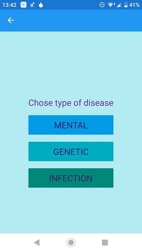
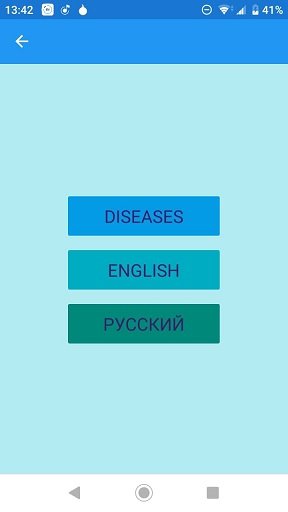
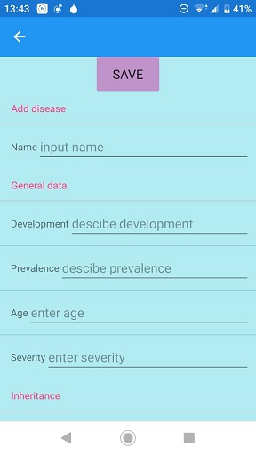
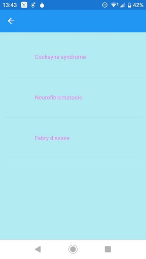
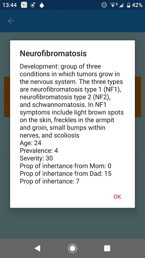
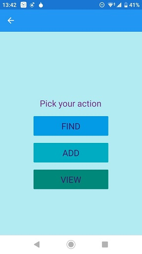

# MedLib

This repo contains my very **first huge university project** on *.Net Xamarin.Forms framework.*   
Main project idea was to create a small medical reference book (thats's why it's called MedLib), the **main functionality of which is focused on information management**: creating, deleting and searching information about diseases.  
More detailed description of the project is given below. 


**Alert:** *I developed this app in the beginning of my second year of studying - fall 2018 - so don't expect high code quality or ingenious design ideas .*

## Table of Contents

- [Overview](#overview)
- [Capabilities and Technology](#capabilities-and-technology)
- [Few more Screenshots](#few-more-screenshots)


## Overview

Project consits of several pages with **front-end created** on **XAML** and **backend** that was written on **C#**.  

Due to it based on *.Net Xamarin.Forms* framework it's fully **cross platform** therefore may be installed on several platforms:
* Windows 10 (and probably Windows 7)
* Android
* iOS 

Features of this project:
1.  Ability to manage disease data (addition, deletion, search)
2.  Localization: app has russian and english versions
3.  Data are stored in JSON file
4.  Animation on greet page (i was forced to do that)

Specification and abstract description of the project capabilities, as it was issued by teachers at the university, may also be found in this repository, in a file called *Xamarin_Forms_Task.doc*. 


## Capabilities and Technology

Users are able to work with three types of diseases, each goes as **separate c# class**: *mental, genetic* or *infectious*. Classes are stored in *MedLib/Logic.cs*.

In android version of app (all screenshots were taken from this version) it looks like this:




**Pages** that implementing project functioning are presented as two related files with the same names but different extensions: *.cs* and *xaml*.  
Each base function have its own pair of pages like GreetPage.xaml.cs+GreetPage.xaml and MainPage.xaml.cs+MainPage.xaml (screenshot located in Localisation section below) for two first screens that you see. There are also pairs of pages like Add.xaml and Add.xaml.cs or  SearchPage.xaml+SearchPage.xaml.cs.


**Localisation** of the task is also implemented in *MedLib/Logic.cs* file.  
A piece of code dedicated to it:


```
        public Options(string ch)
        {
            if(ch == "English")
            {
                dis = "Diseases";
                gen = "Genetic";
                ment = "Mental";
                inf = "Infection";
                leng = "English";
                find = "Find";
                ...
            }
            else
            {
                dis = "Болезни";
                gen = "Генетические";
                ment = "Психические";
                inf = "Инфекция";
                leng = "Русский";
                find = "Поиск";
                ...
            }
        }
```

language choice in the android application looks like this:




## Few more Screenshots

The page for a new disease addition



List of stored genetic diseases 



Information about ailment 



Information management




